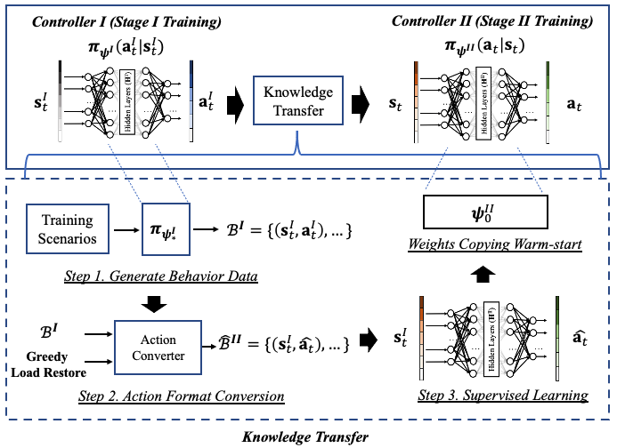
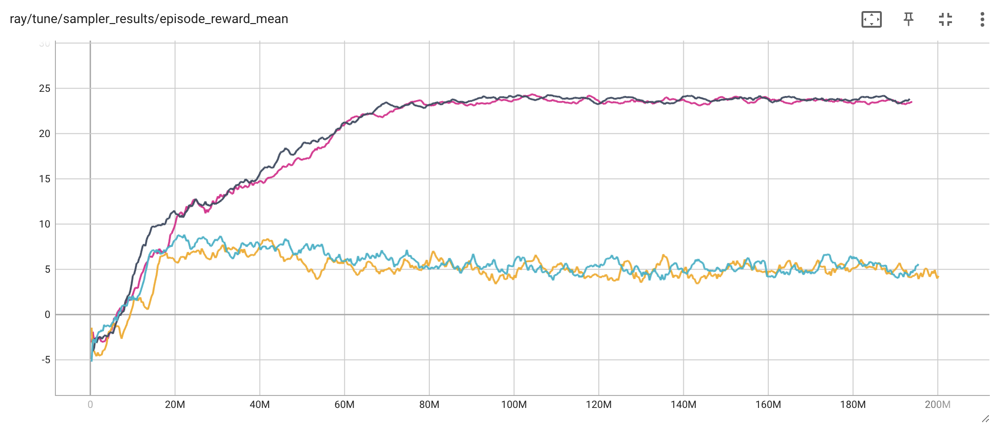
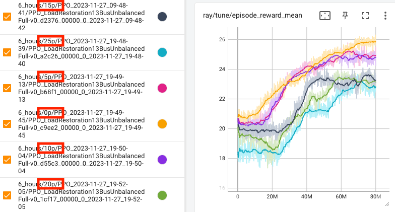

# Training Instructions

The training instructions below are tailored for the NREL high-performance computing system ([Kestrel](https://www.nrel.gov/hpc/kestrel-computing-system.html)). For non-NREL users, the general concepts remain the same, but slight modifications to configuration and training batch scripts may be necessary.

## Training sequence

### Step 1. Stage I Training

The Stage I training can be initiated by calling [`train_stg1.py`](train_stg1.py), the corresponding batch script to run on NREL Kestrel is [`kestrel_multinode_stg1.sh`](kestrel_multinode_stg1.py). We leverage the [evolution strategies algorithm](https://arxiv.org/abs/1703.03864) for 1st stage policy search due to its computational scalability.

### Step 2. Knowledge Transfer

Since Stage I and II have distinct action spaces — the Stage I policy only determines generation set points, while the Stage II policy determines both generation set points and load pickup — the neural networks instantiating these policies have different architectures, to be specific, in terms of output dimensions. As a result, to transfer knowledge, simply copying weights does not work. Instead, we transfer the knowledge by cloning the behavior.

<!--  -->

     
    <em>Knowledge transfer between two stages illustration (Fig.3 from our paper.)</em>

Specifically, to clone the Stage I policy's behavior and adapt to the Stage II policy format, we implement three steps: 
1. Generate behavior data/control trajectories using Stage I policy under training scenarios; 
2. convert all actions to Stage II format based on greedy load restoration; 
3. train a neural network using supervised learning that mimics the state-action pair. 

See the figure above for illustration. The trained neural network can be used to warmstart the Stage II training. 

Code for data generation is [`kt_data_generation.py`](kt_data_generation.py) (Step 1 & 2 above).

Code for behavior cloning is [`kt_behavior_clone.py`](kt_behavior_clone.py) (Step 3).

### Step 3. Stage II Training

Stage II training is implemented in [`train_stg2.py`](train_stg2.py). It first load the supervised learning pretrained network and then warmstart the Stage II training in rllib. In Stage II training, we use the [proximal policy optimization (PPO)](https://arxiv.org/abs/1707.06347) algorithm because its consideration of the KL divergence during policy update makes it suitable to train an already pretrained network (instead of aggressively updating the policy and wiping out knowledge learned in Stage I).

## Things Worth Noting

### Default settings
In the [default configuration](config_parser.py), the default value for `worker-num` is 51, this value is set according to the HPC computational resources, you might need to reduce this number if your computating platform has fewer cores, otherwise, error might occur.

### Reproducing Paper Results

This current code repository has been updated from its original version (the one that generates results in our paper). The updates focus on software version (e.g., from `ray 1.6.0` to `ray 2.7.1`), to make sure the users can use the latest libraries. Despite the major change in software versions including significant changes in rllib API, we make sure this repository can help users to replicate our results in paper, see below.

 
<em>Stage I ES learning curves (corresponding to Fig. 6(a) in our paper.)</em>

For some experiments, using the same hyperparameters may result in convergence to local optima (orange and cyan curves). However, retraining with different initializations improves the obtained policies.

 
<em>Stage II PPO learning curves (corresponding to Fig. 6(b) in our paper.)</em>

Learning curves above conform to the results in our paper.
